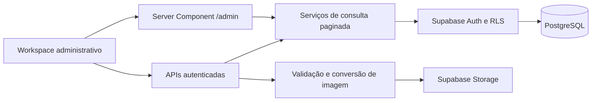

# Arquitetura do portal Geraldo

Atualizado em 05/09/2026. Stack: Next.js App Router, React, TypeScript, Supabase PostgreSQL/Auth/Storage e Vercel. Identidade: branco, bege e laranja queimado.

## Organização

- `src/app`: rotas públicas, entrada administrativa e APIs HTTP.
- `src/components/admin`: workspace, editor de imóveis, detalhe do atendimento, conteúdo e configurações.
- `src/lib/admin-model.ts`: contratos, etapas, validações de publicação e exportação segura para CSV.
- `src/services/admin-workspace.ts`: consultas paginadas, métricas agregadas, detalhe e atualização transacional de atendimento.
- `src/services/repository.ts`: catálogo público, persistência, conteúdo e adaptação dos bancos.
- `src/lib/auth.ts`: sessão e autorização no servidor; `src/proxy.ts`: renovação de cookies Supabase.
- `supabase/migrations`: histórico versionado do banco. `database/schema.sql` permanece como bootstrap histórico; executar também as migrações incrementais.

## Fluxo do painel

O painel possui seções na URL (`/admin?tab=properties`, `leads`, `agenda`, `content`, `settings`). Apenas os dados da seção atual são carregados. Imóveis e atendimentos usam páginas de 12 registros; limites e contagens são calculados no banco. Visão geral usa agregação SQL e cinco contatos recentes. A leitura de detalhe do lead é sob demanda e tem `Cache-Control: private, no-store`.

## Atendimento

O cadastro original de leads é ampliado com responsável, prioridade, próxima ação/prazo, primeiro contato e motivo de perda. Responsável é um nome operacional nesta versão, não uma conta com permissões próprias. Todos os usuários do painel precisam do papel admin.

`save_lead_workflow` bloqueia a linha, compara a versão `updated_at`, grava atendimento e histórico na mesma transação. Versão desatualizada retorna 409 no HTTP. Encerramento remove ações pendentes. `lead_activities` permite leitura e inclusão administrativa; atualização/exclusão direta não são concedidas a usuários do painel. Agenda representa próximas ações do atendimento; ainda não é um calendário de disponibilidade de corretores.

## Segurança e publicação

Tabelas do schema `geraldo` usam RLS. O schema `geraldo_private` não é exposto à API. Visitante consulta catálogo publicado e envia leads, sem acesso à leitura desses contatos. A função privada do limitador é um trigger restrito à ingestão, sem execução pública direta; sua execução privilegiada só manipula a tabela privada de contadores. O advisor informa ausência de política nessa tabela privada: acesso direto é intencionalmente negado.

Acesso administrativo depende de `geraldo.profiles.role`, nunca de metadados editáveis do usuário. O usuário criado para operação é configurado fora do Git. Segredos e arquivos `data/` não são versionados. Chave pública Supabase não concede privilégios administrativos.

A API exige origem correspondente, valida os campos e impede publicação sem dados essenciais, área, imagem e preço válido quando exibido. Quantidades são inteiras. Inserção de lead tem limite persistente por telefone no PostgreSQL, inclusive via Data API, e guarda versão/data do consentimento. Isso não substitui CAPTCHA e controle por IP para ataques distribuídos com telefones diferentes.

Fotos originais de até 12 MB são reduzidas no navegador para até 2000 px e no máximo 3 MB. A API repete a validação, converte com sharp e grava WebP. O fluxo fica abaixo do teto de requisição da Vercel. Bucket público é destinado a imagens comerciais; documentos privados não devem ser enviados nele. Limpeza automática de arquivos órfãos permanece no roadmap.

## Conteúdo e localizações

Renomear um item auxiliar no CMS sincroniza seu cadastro normalizado e preserva o ID referenciado pelos imóveis na nuvem. Exclusão de item em uso é recusada. No modo local, os nomes no JSON dos imóveis são atualizados em transação. A hierarquia cidade/bairro/condomínio e a eliminação completa da representação duplicada de conteúdo são próximas migrações; não estão concluídas nesta versão.

## Ambientes e implantação

- Produção: Vercel `geraldo-imobiliaria`, Supabase `habiqagnbbwpefwjmyyp` (Imobiliaria-geraldo).
- Desenvolvimento: SQLite quando as variáveis Supabase estiverem ausentes; com variáveis, usa o projeto configurado. O workspace foi conectado à nuvem para validação desta entrega.
- Preview: não herda credenciais de produção. Provisionar banco de homologação antes de habilitar testes compartilhados em previews.
- `GET /api/health`: 200 quando a consulta de configurações funciona, 503 em falha, sem expor detalhes internos.
- CI: tipos, testes PostgreSQL isolados e build. A integração Git Vercel ainda pode publicar independentemente do resultado desse workflow; gates de promoção/proteção de branch são trabalho futuro.

## Limites conhecidos

A consulta pública de catálogo ainda filtra em memória e tem teto no carregar mais; a paginação real desta entrega é do painel. Preço sob consulta oculta a apresentação, não é uma garantia de confidencialidade na API pública atual. Não cadastrar preço confidencial até a migração de projeção pública. Backup/restauração, SMTP de produção, verificação de recuperação por e-mail, domínio próprio, papéis editor/comercial, CRM externo e auditoria geral permanecem no roadmap. Troca de senha autenticada está disponível em Configurações.
