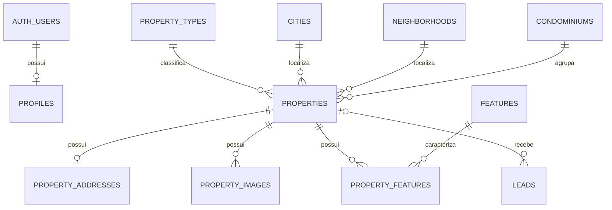

# Modelo do banco — Geraldo Imobiliária

Definição executável: `schema.sql`. Estrutura validada em PostgreSQL embarcado; ainda não aplicada no Supabase remoto.

## Tabelas

| Tabela             | Finalidade                                                    |
| ------------------ | ------------------------------------------------------------- |
| profiles           | Vincula o usuário do Supabase Auth ao papel admin/viewer      |
| properties         | Catálogo, valores, áreas, disponibilidade, publicação e SEO   |
| property_addresses | Endereço separado, protegido conforme a privacidade do imóvel |
| property_images    | Fotos, legendas e posição; a primeira imagem é a capa         |
| property_features  | Relação entre imóveis e diferenciais                          |
| features           | Catálogo de diferenciais                                      |
| property_types     | Tipos de imóvel                                               |
| cities             | Cidades                                                       |
| neighborhoods      | Bairros                                                       |
| condominiums       | Condomínios                                                   |
| leads              | Contato, interesse, status comercial e UTMs                   |
| content            | FAQ, depoimentos e itens editáveis do CMS                     |
| site_settings      | Identidade, textos, contatos e IDs públicos de marketing      |

`content` reúne FAQ e depoimentos por tipo, mantendo compatibilidade com o painel existente. As configurações são públicas por definição: nunca armazenar tokens, senhas ou chaves privadas em `site_settings`.

## Relações



## Regras de acesso

- Visitante: consulta imóveis publicados disponíveis/reservados, envia leads e consulta conteúdo público.
- Usuário comum: não tem acesso administrativo nem pode promover o próprio perfil.
- Administrador: gerencia catálogo, fotos, leads e conteúdo; papel verificado no banco.
- Endereço completo: só liberado publicamente em imóveis publicados com `map_mode = exact`.
- Fotos: upload e alteração restritos a administradores; bucket público para as fotos comerciais.
- Exclusão de imóvel: remove fotos e relações do banco, mas preserva o lead com referência nula. Remover o objeto físico do Storage exige rotina de limpeza específica.
- UUIDs nas entidades, códigos/slugs únicos, timestamps automáticos e índices de consulta.
- A função `save_property` salva imóvel, endereço, fotos e diferenciais dentro da mesma transação.

## Testar novamente

```sh
npm run test:database
```

O teste usa um banco isolado em memória, sem credenciais nem dados reais. O relatório é salvo em `TEST-RESULTS.md`. O teste não valida o serviço remoto de login, a API PostgREST nem o upload real de arquivos.
